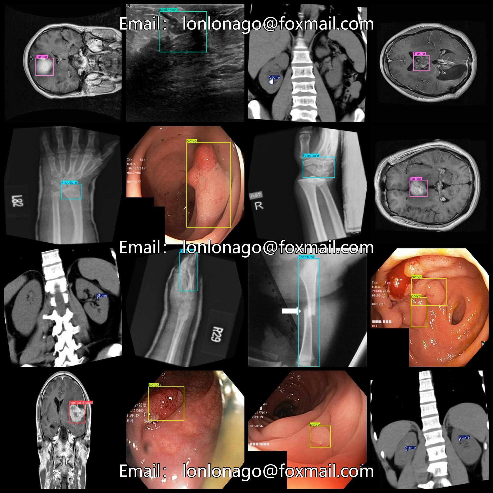
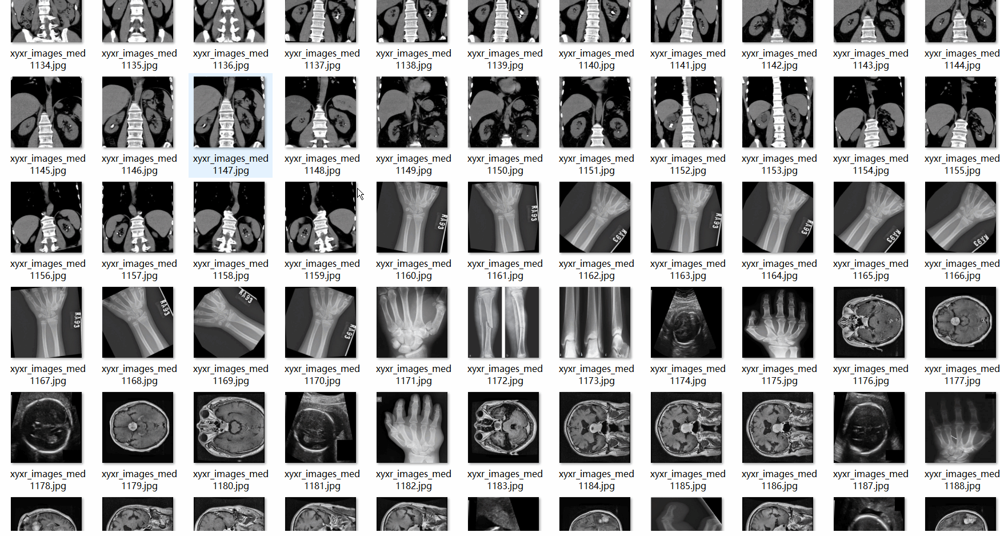

# Medical Image Classification and <g id="Bold">Diagnosis:</g> Dataset 5040 imagesVOC+YOLO

Medical Image Classification and Diagnostic Dataset 5040 VOCs + YOLOs

Dataset format: Pascal VOC format + YOLO format (the txt file does not contain the split path, it only contains jpg images and corresponding VOC format xml files and yolo format txt files)

Number of image files: 5040

Number of xml files: 5040

Number of annotations (number of txt files): 5040

Tagged Category Count: 8

The Github repository is: datasets_sl

["Benign", "Fracture", "HC", "Malignant", "Stone", "Tumor", "hemorrhage", "polyp"]

Benign," fracture," HC, "malignant," "calculus," "tumor," "bleeding," "polyp

Number of boxes labeled in each category:

Benign frames = 188

Fracture Frames = 813

HC Frame Count = 333

Malignant Frames = 189

Stone Frame Number = 1533

Tumor frame count = 721

Hemorrhage Frames = 927

polyp frame count = 1277

Total Frames: 5981

Number of images per category:

Benign possession count = 175

Fracture occupancy of image count = 719

HC occupancy of the image count = 332

Malignant occupancy rate = 189

Stone owns 1153 pictures.

Tumor occupies the image number = 694

Hemorrhage occupies a total of 794 images.

polyp annotated images = 995

Image resolution: 640x640

Use the labeling tool: labelImg

Dataset Augmentation: Yes

Rules for annotation: Draw a rectangle around the category.

Important note: The dataset does not have been divided into training, validation, and testing sets.

Special Disclaimer: This dataset does not guarantee the accuracy of the trained models or weight files.

Annotation and image details are as follows:

## Images

---

Here is a pay link on Stripe (https://buy.stripe.com/3cs8yP7sY87d0vu9AB). Please contact me lonlonago@foxmail.com after funding $89, and I will send you a complete data files, thank you!

